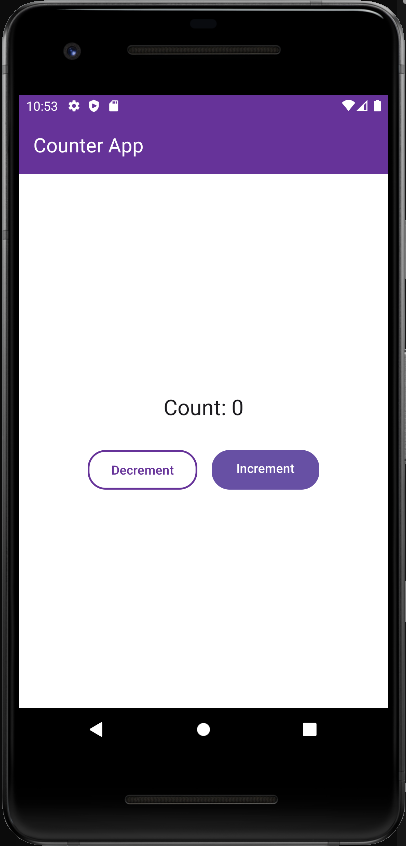

# Counter App with React Native, Expo, Paper UI, and Redux

This is a simple counter application built using React Native, Expo, Paper UI, and Redux. It allows users to increment or decrement a counter value, and the updated value is displayed in the UI.

## Screenshots



## Features

- Increment and decrement the counter value.
- Display the updated counter value in the UI.
- Use of Redux for state management.
- Use of Expo for easy cross-platform development.
- Use of Paper UI for a modern and responsive user interface.

## Installation

1. Clone the repository:
```bash
git clone https://github.com/GopalVerma1303/RN-paper-ui.git
```

2. Navigate to the project directory:

```bash
cd RN-paper-ui
```

3. Install dependencies using npm or yarn:
```bash
npm install
``` 
or
```bash
yarn install
``` 

4. Start the Expo development server:
```bash
npm start
``` 
or
```bash
yarn start
``` 


5. Use Expo Go app on your iOS or Android device to scan the QR code displayed in the Expo development server to run the app on your device.

## Dependencies

This project uses the following major dependencies:

- React Native: A popular JavaScript framework for building mobile apps using React.
- Expo: A set of tools and services for building, deploying, and managing Expo apps.
- React Native Paper: A Material Design implementation for React Native.
- Redux: A predictable state container for managing the global state of the application.

## Folder Structure
```bash

- .gitignore
- App.tsx
- README.md
- app.json
- assets/
  ├── - adaptive-icon.png
  ├── - favicon.png
  ├── - icon.png
  ├── - screenshots/
    └── - screenshot-1.png
  └── - splash.png
- babel.config.js
- package-lock.json
- package.json
- src/
  ├── - redux/
    ├── - actions/
      └── - counterActions.ts
    ├── - reducers/
      └── - countReducer.ts
    └── - store.ts
  └── - screens/
    └── - Home.tsx
- tsconfig.json
- yarn-error.log
- yarn.lock


```

